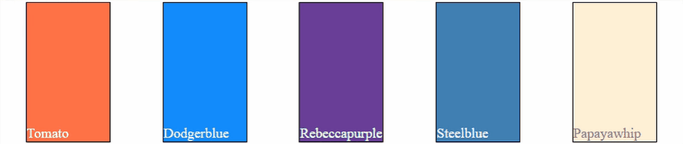

# LoadingIndicatorJSLibrary

**LoadingIndicatorJSLibrary** is a minimalist Javascript library for showing busy icon or msg on the top of any DOM element.


**LoadingIndicatorJSLibrary** was created because I wanted to practice writing Javascript libraries. So **feel free** to fork and create pull requests!

_**demo**_


Find the working documentation <a href="https://github.com/mailtodanish/LoadingIndicatorJSLibrary/tree/main/example" target="_blank">here</a>

Written by [Mohammad Ahshan Danish](https://github.com/mailtodanish).


### JavaScript

_**display**_  method is to display busy msg on top of the element.
_**remove**_ method is to remove busy msg.
```js
<script>
        require(['./loading-indicator-min-amd.js'], function(Loading) {
            const loadingMsg = new Loading("boxesId", {
                innerText: "Please wait..."
            });


// show busy
loadingMsg.display();
// remove busy
loadingMsg.remove();

        });
    </script>
```
